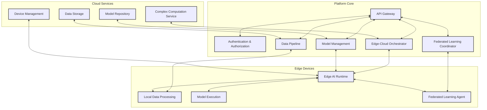

# EdgeAIForge

EdgeAIForge is an open-source distributed platform for running AI models on edge devices, with seamless integration to cloud services for more complex computations.

## Table of Contents

- [Features](#features)
- [Architecture](#architecture)
- [Getting Started](#getting-started)
  - [Prerequisites](#prerequisites)
  - [Installation](#installation)
- [Usage](#usage)
- [Contributing](#contributing)
- [Roadmap](#roadmap)
- [License](#license)
- [Acknowledgments](#acknowledgments)

## Features

- **Edge AI Runtime**: Lightweight runtime for deploying and running AI models on various edge devices.
- **Model Management**: Version control and easy deployment mechanisms for AI models.
- **Federated Learning Support**: Train models across distributed edge devices with privacy-preserving mechanisms.
- **Edge-Cloud Hybrid Processing**: Seamlessly offload complex computations to the cloud.
- **Device Management**: Central dashboard for monitoring and managing edge devices.
- **Data Pipeline**: Efficient data collection, preprocessing, and synchronization between edge and cloud.
- **Security Features**: End-to-end encryption and secure model deployment.
- **API and SDK**: Well-documented API and SDKs for major programming languages.
- **Extensibility**: Plugin system for custom modules and integrations.

## Architecture

EdgeAIForge is built with a modular architecture, consisting of the following main components:

1. **Edge Runtime**: Runs on edge devices, manages local model execution and data processing.
2. **Cloud Services**: Handles complex computations, stores aggregated data, and manages models.
3. **Platform Core**: Coordinates between edge devices and cloud services, manages API requests, and orchestrates federated learning.

High-level architecture diagram of EdgeAIForge:



This diagram illustrates the relationships between different components of EdgeAIForge, showing how data and control flow between the Edge Devices, Cloud Services, and the Platform Core.

For more detailed information on each component, please refer to their individual README files in their respective directories.

## Getting Started

### Prerequisites

- Rust 1.55.0 or later
- Cargo package manager
- Git

### Installation

1. Clone the repository:

   ```
   git clone https://github.com/doziestar/edgeaiforge.git
   cd edgeaiforge
   ```

2. Build the project:

   ```
   cargo build --release
   ```

3. Run tests to ensure everything is set up correctly:
   ```
   cargo test
   ```

## Usage

Here's a quick example of how to use EdgeAIForge to deploy a model to an edge device:

```rust
use edgeaiforge::edge_runtime::EdgeRuntime;
use edgeaiforge::model_management::Model;

fn main() {
    // Initialize the edge runtime
    let mut runtime = EdgeRuntime::new();

    // Load a model
    let model = Model::load("path/to/model.onnx").unwrap();

    // Deploy the model to the edge runtime
    runtime.deploy_model(model).unwrap();

    // Run inference
    let input = vec![1.0, 2.0, 3.0];
    let output = runtime.run_inference(&input).unwrap();

    println!("Inference output: {:?}", output);
}
```

For more detailed usage instructions and examples, please refer to our [User Guide](docs/user_guide.md).

## Contributing

We welcome contributions to EdgeAIForge! Please see our [Contributing Guidelines](CONTRIBUTING.md) for more details on how to get started.

## Roadmap

See the [open issues](https://github.com/doziestar/edgeaiforge/issues) for a list of proposed features and known issues. Our high-level roadmap includes:

1. Q3 2024: Stable release of core Edge Runtime and Model Management features
2. Q4 2024: Implementation of Federated Learning capabilities
3. Q1 2025: Launch of Cloud Services integration
4. Q2 2025: Release of comprehensive API and SDKs

## License

This project is licensed under the Apache License 2.0 - see the [LICENSE](LICENSE) file for details.

## Acknowledgments

- Thanks to all the contributors who have helped shape EdgeAIForge.
- Special thanks to the Rust community for providing excellent libraries and tools.
- Inspired by advancements in edge computing and distributed AI systems.

---

For any questions or support, please open an issue on GitHub or contact our team at support@datavinci.so.
