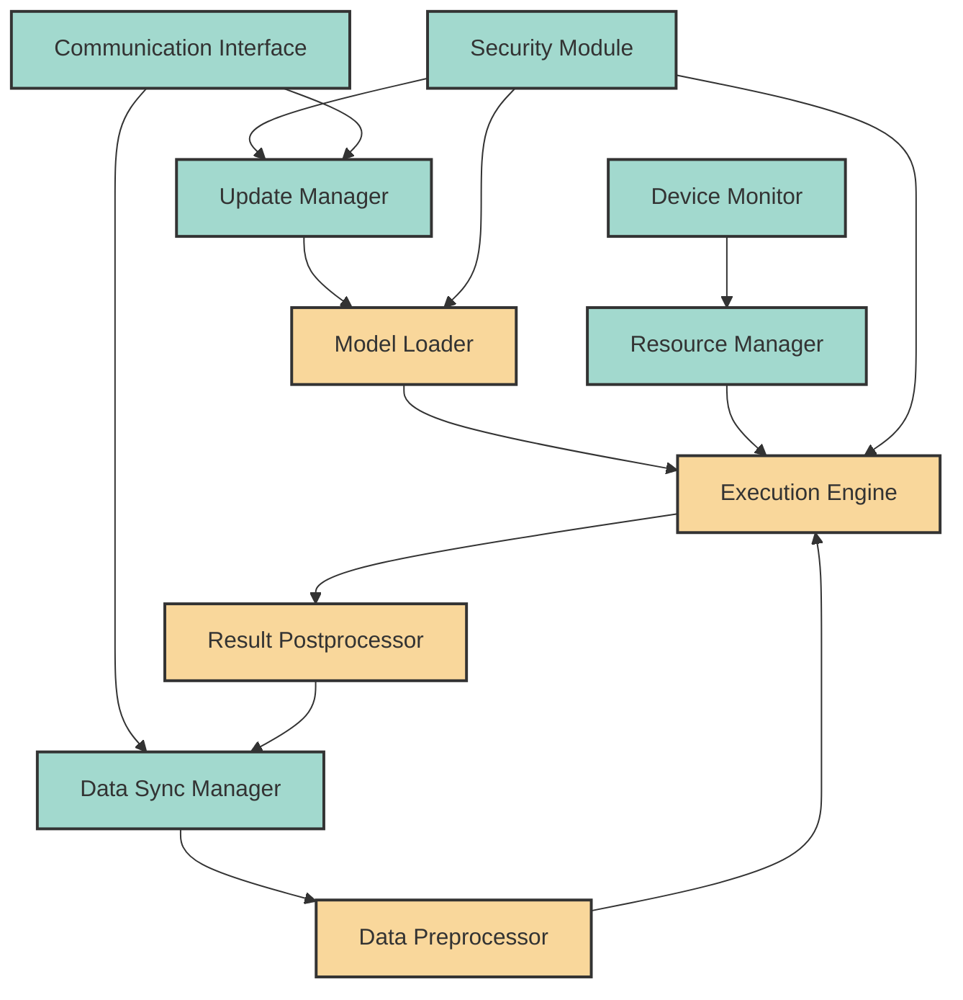

# EdgeAIForge: Edge Runtime Module

The Edge Runtime module is a core component of EdgeAIForge, responsible for managing the execution of AI models on edge devices.

## Architecture

The Edge Runtime module consists of several subcomponents working together to provide efficient model execution and data processing on edge devices. Here's a diagram illustrating its architecture:



### Components

1. **Model Loader**: Responsible for loading AI models onto the edge device.
2. **Execution Engine**: Runs the AI models, managing inference requests.
3. **Data Preprocessor**: Prepares input data for model inference.
4. **Result Postprocessor**: Processes and formats inference results.
5. **Device Monitor**: Tracks device health and performance metrics.
6. **Resource Manager**: Allocates computational resources for model execution.
7. **Update Manager**: Handles model and runtime updates.
8. **Security Module**: Ensures secure model execution and data handling.
9. **Communication Interface**: Manages communication with the Platform Core.
10. **Data Sync Manager**: Coordinates data synchronization with the cloud.

## Features

- Efficient model execution on resource-constrained devices
- Support for multiple AI frameworks (TensorFlow Lite, PyTorch Mobile, ONNX Runtime)
- Real-time data preprocessing and result postprocessing
- Secure model deployment and execution
- Automatic updates and version management
- Resource-aware scheduling and execution

## Usage

Here's a basic example of how to use the Edge Runtime in your Rust code:

```rust
use edgeaiforge_edge_runtime::{EdgeRuntime, Model, InferenceInput};

fn main() -> Result<(), Box<dyn std::error::Error>> {
    // Initialize the Edge Runtime
    let mut runtime = EdgeRuntime::new()?;

    // Load a model
    let model = Model::load("path/to/model.onnx")?;
    runtime.deploy_model(model)?;

    // Prepare input data
    let input = InferenceInput::new(vec![1.0, 2.0, 3.0]);

    // Run inference
    let output = runtime.run_inference(&input)?;

    println!("Inference output: {:?}", output);

    Ok(())
}
```

For more detailed usage instructions and API documentation, please refer to the [API docs](../docs/api/edge_runtime.md).

## Configuration

The Edge Runtime can be configured via a TOML file. Here's an example configuration:

```toml
[edge_runtime]
max_concurrent_models = 3
enable_gpu = true
log_level = "info"

[security]
enable_encryption = true
encryption_key_path = "/path/to/key.pem"

[communication]
heartbeat_interval = 60  # seconds
```

## Contributing

Contributions to the Edge Runtime module are welcome! Please see the [Contributing Guidelines](../CONTRIBUTING.md) for more information on how to get started.

## License

This module, as part of the EdgeAIForge project, is licensed under the Apache License 2.0. See the [LICENSE](../LICENSE) file for details.
