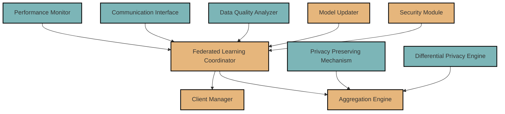

# EdgeAIForge: Federated Learning Module

The Federated Learning module enables distributed machine learning across edge devices while preserving data privacy.

## Architecture

The Federated Learning module consists of several components working together to facilitate secure and efficient distributed learning:



### Components

1. **Federated Learning Coordinator**: Orchestrates the entire federated learning process.
2. **Aggregation Engine**: Aggregates model updates from multiple clients.
3. **Client Manager**: Manages participating edge devices and their contributions.
4. **Security Module**: Ensures secure communication and model update sharing.
5. **Model Updater**: Applies aggregated updates to the global model.
6. **Data Quality Analyzer**: Assesses the quality of contributions from clients.
7. **Communication Interface**: Handles communication with edge devices.
8. **Performance Monitor**: Tracks the performance of the federated learning process.
9. **Privacy Preserving Mechanism**: Implements techniques like secure multi-party computation.
10. **Differential Privacy Engine**: Adds noise to protect individual privacy.

## Features

- Distributed learning across edge devices
- Privacy-preserving mechanisms
- Secure aggregation of model updates
- Differential privacy implementation
- Performance monitoring and optimization
- Adaptive client selection

## Usage

Here's a basic example of how to use the Federated Learning module in your Rust code:

```rust
use edgeaiforge_federated_learning::{FederatedLearningCoordinator, FederatedModel, ClientConfig};

fn main() -> Result<(), Box<dyn std::error::Error>> {
    // Initialize the Federated Learning Coordinator
    let mut coordinator = FederatedLearningCoordinator::new()?;

    // Create a new federated model
    let model = FederatedModel::new("federated_image_classifier", "/path/to/initial_model.onnx")?;

    // Add the model to the coordinator
    coordinator.add_model(model)?;

    // Configure client participation
    let client_config = ClientConfig::new()
        .min_clients(10)
        .max_clients(100)
        .rounds(50);

    // Start federated learning process
    coordinator.start_learning("federated_image_classifier", client_config)?;

    // Monitor progress
    let progress = coordinator.get_learning_progress("federated_image_classifier")?;
    println!("Learning progress: {:?}", progress);

    Ok(())
}
```

For more detailed usage instructions and API documentation, please refer to the [API docs](../docs/api/federated_learning.md).

## Configuration

The Federated Learning module can be configured via a TOML file. Here's an example configuration:

```toml
[coordinator]
aggregation_method = "fedavg"
rounds_per_evaluation = 5

[privacy]
enable_differential_privacy = true
epsilon = 0.1
delta = 1e-5

[security]
encryption_enabled = true
encryption_key_path = "/path/to/key.pem"

[performance]
client_timeout = 300  # seconds
max_stragglers = 0.1  # 10% of clients
```

## Contributing

Contributions to the Federated Learning module are welcome! Please see the [Contributing Guidelines](../CONTRIBUTING.md) for more information on how to get started.

## License

This module, as part of the EdgeAIForge project, is licensed under the Apache License 2.0. See the [LICENSE](../LICENSE) file for details.
