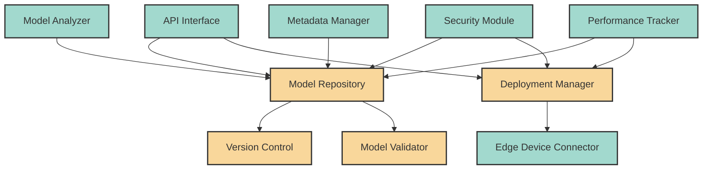

# EdgeAIForge: Model Management Module

The Model Management module is responsible for version control, deployment, and lifecycle management of AI models in the EdgeAIForge platform.

## Architecture

The Model Management module consists of several components working together to provide comprehensive model management capabilities:



### Components

1. **Model Repository**: Central storage for all AI models.
2. **Version Control**: Manages different versions of models.
3. **Model Validator**: Ensures models meet required standards before deployment.
4. **Deployment Manager**: Handles the deployment of models to edge devices.
5. **Edge Device Connector**: Interfaces with edge devices for model deployment.
6. **Model Analyzer**: Analyzes model structure and performance characteristics.
7. **API Interface**: Provides RESTful API for model management operations.
8. **Security Module**: Ensures secure storage and transmission of models.
9. **Metadata Manager**: Manages metadata associated with each model.
10. **Performance Tracker**: Tracks and reports on model performance across devices.

## Features

- Version control for AI models
- Secure model storage and deployment
- Model validation and analysis
- Metadata management for models
- Performance tracking and reporting
- RESTful API for model management operations

## Usage

Here's a basic example of how to use the Model Management module in your Rust code:

```rust
use edgeaiforge_model_management::{ModelManager, Model, ModelMetadata};

fn main() -> Result<(), Box<dyn std::error::Error>> {
    // Initialize the Model Manager
    let model_manager = ModelManager::new()?;

    // Create a new model
    let model = Model::new("my_model", "/path/to/model.onnx")?;
    let metadata = ModelMetadata::new("Image Classification", "1.0.0");

    // Add the model to the repository
    model_manager.add_model(model, metadata)?;

    // Deploy the model to an edge device
    model_manager.deploy_model("my_model", "edge_device_id")?;

    // Get model performance statistics
    let stats = model_manager.get_model_stats("my_model")?;
    println!("Model performance: {:?}", stats);

    Ok(())
}
```

For more detailed usage instructions and API documentation, please refer to the [API docs](../docs/api/model_management.md).

## Configuration

The Model Management module can be configured via a TOML file. Here's an example configuration:

```toml
[model_repository]
storage_path = "/path/to/model/storage"
max_versions_per_model = 5

[deployment]
default_device_timeout = 30  # seconds

[security]
encryption_enabled = true
encryption_key_path = "/path/to/key.pem"

[performance_tracking]
metrics_retention_period = 90  # days
```

## Contributing

Contributions to the Model Management module are welcome! Please see the [Contributing Guidelines](../CONTRIBUTING.md) for more information on how to get started.

## License

This module, as part of the EdgeAIForge project, is licensed under the Apache License 2.0. See the [LICENSE](../LICENSE) file for details.
